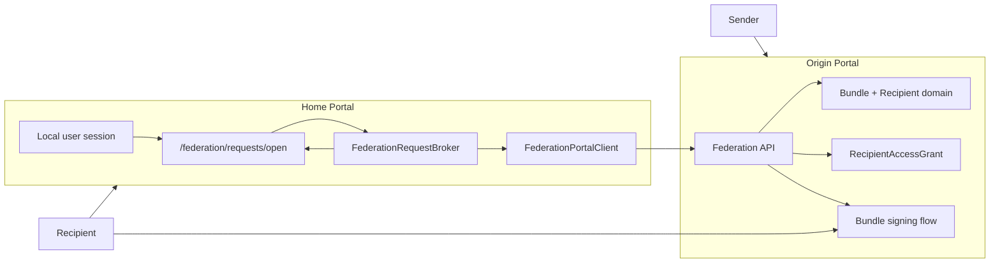
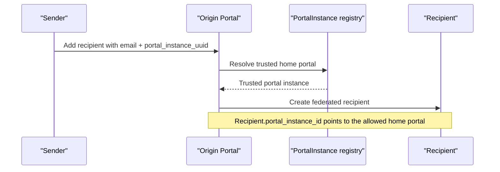
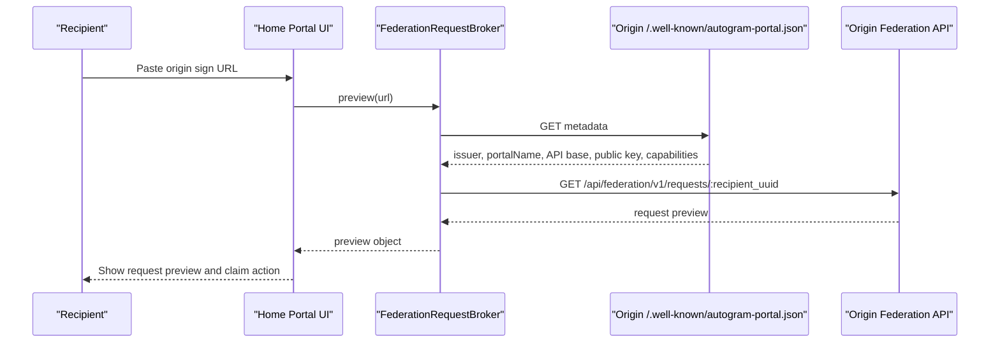
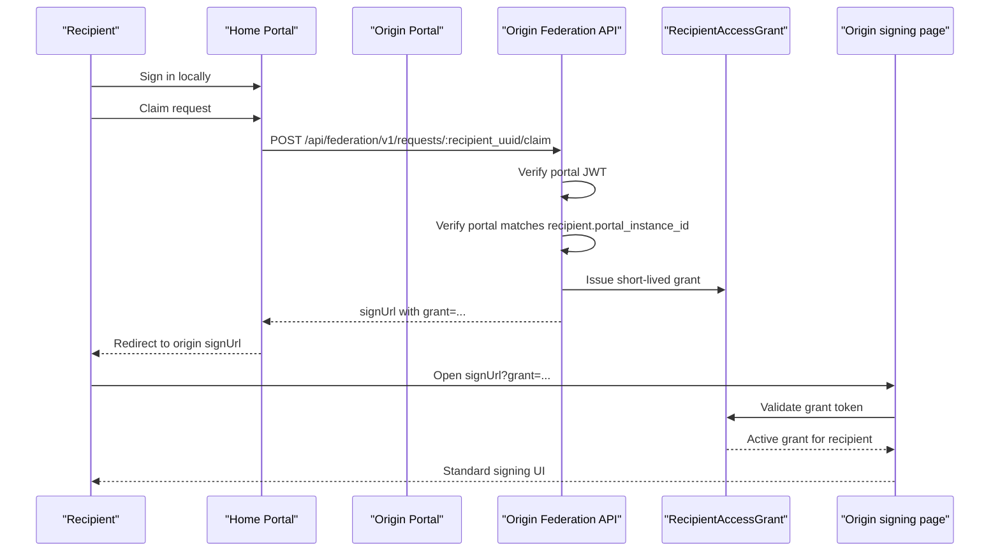

# Federation Architecture

This document describes the technical design of the federation feature in Autogram Portal.

It complements the user-facing documentation and Swagger/OpenAPI documentation by focusing on:

- architectural responsibilities
- request flow between portal instances
- trust boundaries
- core models and services
- current limitations and extension points

## Goals

The federation feature solves two related problems:

1. A sender on one Autogram Portal instance can assign a recipient to another portal instance.
2. A recipient can paste a signing link from a foreign portal into their own portal and continue from there.

The implementation intentionally keeps the origin portal as the source of truth for bundle state, recipient state, and signed output.

## Core Concepts

### Origin portal

The portal where the bundle was created.

Responsibilities:

- owns `Bundle`, `Recipient`, `SignerContract`, and signed document state
- decides which home portal is allowed to claim a federated recipient
- issues short-lived recipient access grants
- completes signing on the origin-side UI and session flow

### Home portal

The portal where the recipient wants to sign in and start the flow.

Responsibilities:

- accepts a pasted origin signing URL
- discovers the origin portal dynamically from metadata
- fetches request preview from the origin portal
- authenticates the local user
- sends the claim request to the origin portal

### Sender-side trust

Sender-side federation routing is explicit.

When a sender assigns a federated recipient, they choose a trusted home portal from the local `PortalInstance` registry. That registry determines where the origin portal is willing to send a federated recipient.

### Recipient-side opening

Recipient-side opening is more permissive.

The recipient can paste a foreign origin link into a portal that has never seen that origin before. The home portal discovers the origin dynamically by reading its metadata document.

This does **not** mean the origin portal trusts arbitrary claimers. The origin portal still enforces that only the home portal assigned to the federated recipient may claim that request.

## High-Level Architecture

## Trust Model

There are two different trust decisions in the current system.

### 1. Sender-side trust

Controlled by `PortalInstance` records.

Used when:

- adding a federated recipient to a bundle
- choosing which home portal is allowed to claim that recipient later

This is explicit local configuration.

### 2. Recipient-side discovery

Controlled by the pasted URL plus the origin portal's metadata document.

Used when:

- opening a foreign signing link on the home portal
- fetching preview metadata from an origin portal not previously configured locally

This is dynamic and does not require a local `PortalInstance` entry for the origin.

### Important consequence

The home portal may dynamically discover an origin portal.

The origin portal may **not** dynamically trust the home portal for claim authorization.

Claim authorization is still bound to the `portal_instance_id` assigned to the recipient at creation time.

## Main Flow

### A. Sender creates a federated recipient

### B. Recipient pastes foreign link into home portal

### C. Recipient claims request and returns to origin portal

## Request and Endpoint Inventory

### Public metadata

- `GET /.well-known/autogram-portal.json`

Purpose:

- lets another portal discover federation support dynamically
- advertises issuer and API base URL
- advertises the public key used to verify portal assertions

Served by:

- `Federation::MetadataController`
- backed by `FederationConfiguration`

### Home-portal UI

- `GET /federation/requests/open`
- `POST /federation/requests/claim`

Purpose:

- accept pasted origin URL
- preview foreign request
- claim request using the locally authenticated user

Served by:

- `Federation::RequestsController`

### Home-portal inbound invitation API

- `POST /api/federation/v1/request_invitations`
- `POST /api/federation/v1/request_invitations/:recipient_uuid/withdraw`

Purpose:

- accept pushed signing-request invitations from a trusted origin portal
- store them locally so they appear in the existing received-bundles experience
- resolve previously pushed invitations as signed, superseded, or withdrawn without deleting audit history

Served by:

- `Api::Federation::V1::RequestInvitationsController`
- authenticated by `FederationApiController`
- stored in `FederationRequestInvitation`

### Origin federation API

- `GET /api/federation/v1/requests/:recipient_uuid`
- `POST /api/federation/v1/requests/:recipient_uuid/claim`

Purpose:

- preview a request for a trusted or dynamically discovered home portal
- exchange a valid portal assertion for a short-lived sign URL

Served by:

- `Api::Federation::V1::RequestsController`
- authenticated by `FederationApiController`
- verified by `PortalAssertionAuthenticator`

## Class and Service Responsibilities

### `PortalInstance`

File: `app/models/portal_instance.rb`

Represents a trusted home portal for sender-side routing.

Responsibilities:

- store the issuer, base URL, and public key of the allowed home portal
- validate URL safety
- provide optional email-domain hints
- determine which home portal a federated recipient is allowed to use

### `Recipient`

File: `app/models/recipient.rb`

Federation-related responsibilities:

- distinguishes `local` vs `federated` recipients via `federation_mode`
- stores `portal_instance_id` for federated recipients
- records remote claim audit fields
- revokes active access grants when withdrawn

### `RecipientAccessGrant`

File: `app/models/recipient_access_grant.rb`

Represents the short-lived token that bridges the claim flow back into the origin signing flow.

Responsibilities:

- issue opaque one-hop access tokens
- store only the token digest
- track expiry and revocation
- revoke old grants for the same recipient/home portal pair

### `Federation::RequestsController`

File: `app/controllers/federation/requests_controller.rb`

User-facing home-portal controller.

Responsibilities:

- accept the pasted origin URL
- show request preview
- use the current local user as claimant data
- redirect to the origin sign URL after successful claim

### `FederationRequestBroker`

File: `app/services/federation_request_broker.rb`

Main home-portal orchestration service.

Responsibilities:

- parse the origin URL
- derive `bundle_uuid` and `recipient_uuid`
- validate the origin base URL
- fetch and interpret origin metadata
- ensure required federation capabilities exist
- call preview and claim via `FederationPortalClient`

This is the main place where dynamic origin discovery is implemented.

### `FederationPortalClient`

File: `app/services/federation_portal_client.rb`

Low-level HTTP client used by the home portal.

Responsibilities:

- fetch origin metadata
- fetch request preview from origin
- send claim request to origin
- create portal-signed JWT bearer headers using `FederationAssertionToken`

### `FederationAssertionToken`

File: `app/services/federation_assertion_token.rb`

Signs outgoing portal assertions.

Responsibilities:

- issue JWTs with `iss`, `aud`, `exp`, `jti`, and `scope`
- sign with `FEDERATION_PRIVATE_KEY_PEM`

### `PortalAssertionAuthenticator`

File: `app/services/portal_assertion_authenticator.rb`

Verifies incoming portal assertions on the origin portal.

Responsibilities:

- decode and validate the portal JWT
- resolve the caller by `iss`
- load the caller public key from `PortalInstance.public_key_pem`
- verify `aud`, `exp`, `jti`, and required `scope`

### `FederationApiController`

File: `app/controllers/federation_api_controller.rb`

Shared API base controller for federation endpoints.

Responsibilities:

- parse bearer token
- authenticate portal caller
- expose `current_portal_assertion` and `current_portal_instance`
- enforce JSON request/response behavior

### `Api::Federation::V1::RequestsController`

File: `app/controllers/api/federation/v1/requests_controller.rb`

Origin-side federation API.

Responsibilities:

- load recipient by UUID
- ensure recipient is still claimable
- ensure calling home portal matches the recipient's assigned `portal_instance_id`
- issue short-lived access grants
- return the origin-side sign URL

### `Api::Federation::V1::RequestInvitationsController`

File: `app/controllers/api/federation/v1/request_invitations_controller.rb`

Home-portal inbound federation API.

Responsibilities:

- accept idempotent invitation pushes from a trusted origin portal
- match invitations to a local user by email when possible
- keep the full invitation payload for display in the received-bundles UI
- mark invitations withdrawn when the origin portal retracts them

### `BundlesController`

File: `app/controllers/bundles_controller.rb`

Federation-specific responsibility:

- accept `grant=...` in the normal bundle signing route
- resolve the recipient from the active grant
- continue into the standard signing UI without introducing a separate signing controller path

This is an important design choice: federation reuses the existing signing flow instead of creating a parallel one.

Federation-specific received-flow responsibility:

- mix locally owned received bundles with pushed `FederationRequestInvitation` records in the same user-facing list

## Data Model Summary

### `portal_instances`

Used for sender-side routing and origin-side authorization.

Important fields:

- `base_url`
- `issuer`
- `public_key_pem`
- `status`
- `allowed_email_domains`

### `recipients`

Federation-specific fields:

- `federation_mode`
- `portal_instance_id`
- `remote_claimed_at`
- `remote_claimed_by_email`
- `remote_notified_at`

### `federation_request_invitations`

Used by the home portal to persist invitations pushed from trusted origin portals.

Important fields:

- `portal_instance_id`
- `origin_recipient_uuid`
- `origin_bundle_uuid`
- `recipient_email`
- `recipient_user_id`
- `status`
- `withdrawn_at`
- `payload`

### `recipient_access_grants`

Used only after a successful claim.

Important fields:

- `token_digest`
- `expires_at`
- `revoked_at`
- `claim_jti`
- `portal_instance_id`
- `recipient_id`

## Security Boundaries

### What the home portal is allowed to do

- discover a foreign origin portal dynamically
- fetch a preview of a request
- submit a claim using a locally authenticated user identity

### What the home portal is not allowed to decide

- whether it is an authorized home portal for that recipient
- whether the recipient is still active or already superseded
- whether the bundle is complete

Those decisions remain on the origin portal.

### Why metadata is public

The metadata document is an identity and capability advertisement.

Its most important field is `publicKeyPem`, which allows peers to verify portal-signed JWT assertions. The metadata document does **not** itself grant trust; it only describes how to talk to and verify a portal.

## Current Limitations

The current implementation intentionally stops short of full remote signing orchestration.

Current limitations:

- the actual signing still completes on the origin portal
- the home portal stores and surfaces pushed invitations, but does not host the contract signing session itself
- sender-side federation still depends on a preconfigured trusted home-portal list
- the origin portal still requires a configured `PortalInstance` for the assigned home portal; only the home-side origin discovery is dynamic
- pushed invitations now preserve `signed` and `superseded` terminal states for home-portal filtering, but they still do not synchronize richer post-signing history beyond those states

## Extension Points

Likely next steps if the feature grows:

1. Import a `PortalInstance` automatically from a metadata URL in the admin UI.
2. Add stronger key-rotation support such as JWK sets or key identifiers.
3. Push more of the signing session into the home portal if true remote execution becomes necessary.
4. Add richer claim audit reporting and monitoring.

## Related Files

- `app/controllers/federation/requests_controller.rb`
- `app/controllers/federation/metadata_controller.rb`
- `app/controllers/federation_api_controller.rb`
- `app/controllers/api/federation/v1/requests_controller.rb`
- `app/services/federation_request_broker.rb`
- `app/services/federation_portal_client.rb`
- `app/services/federation_assertion_token.rb`
- `app/services/portal_assertion_authenticator.rb`
- `app/services/federation_configuration.rb`
- `app/models/portal_instance.rb`
- `app/models/recipient.rb`
- `app/models/recipient_access_grant.rb`
- `app/controllers/bundles_controller.rb`